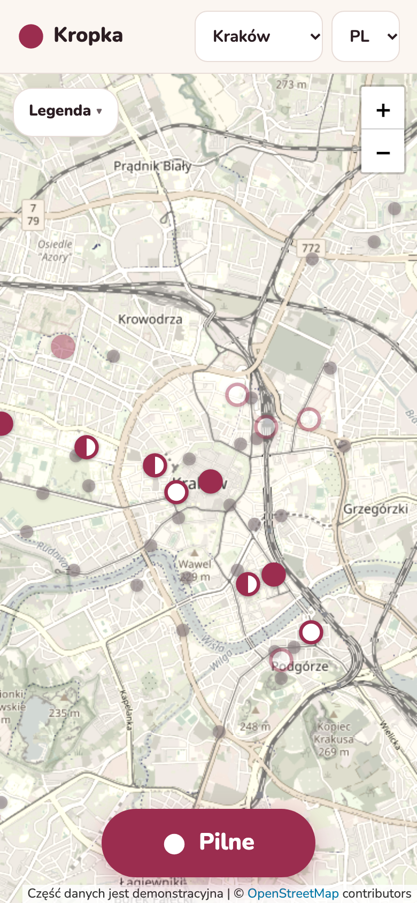
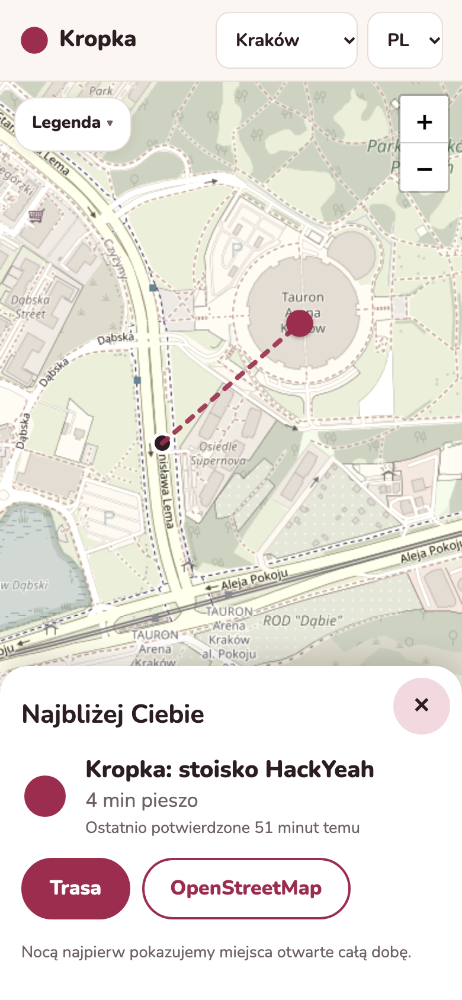
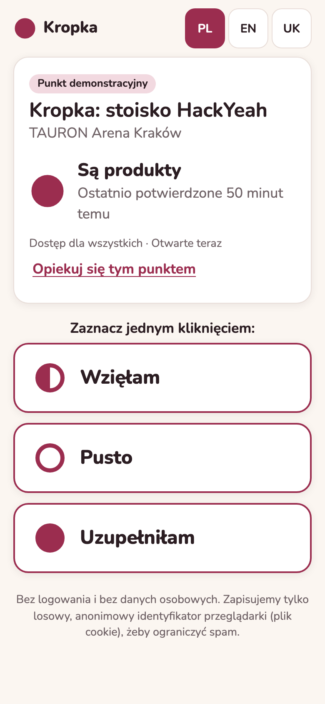
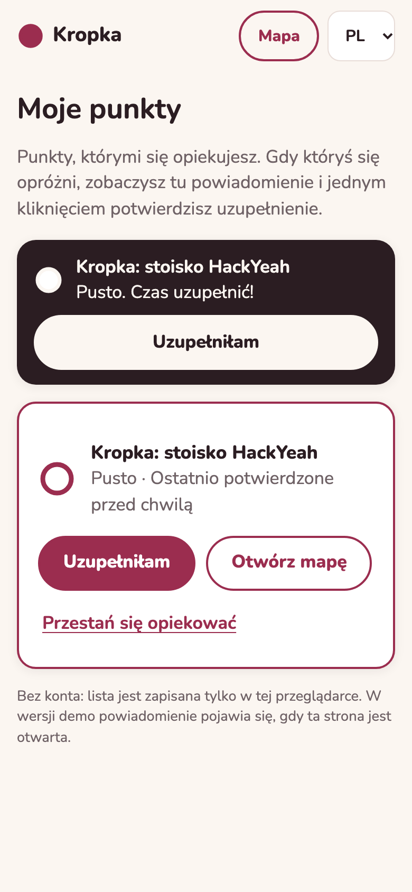
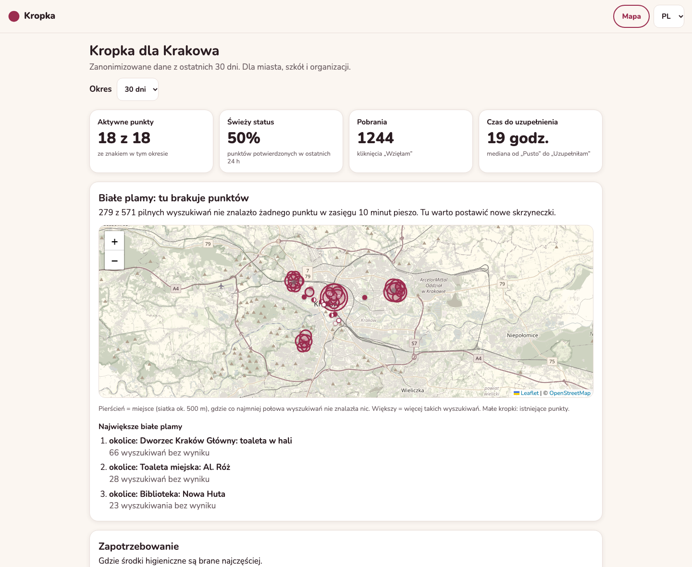

# Kropka

**A live map of free menstrual hygiene products in Kraków, Warszawa, Wrocław and Gdańsk.** Built at HackYeah 2026 for the task "ImpactHer: Technology for Real Change".

Free pad and tampon boxes already exist in cafés, libraries and schools, but nobody knows whether a box is full right now or where new ones are needed. Kropka fixes that in three ways:

1. **Live status.** A QR sticker on every box opens a page with three big buttons: **Wzięłam / Pusto / Uzupełniłam** (Took / Empty / Refilled). No app, no account, two seconds.
2. **Urgent.** One tap shows the nearest point that is in stock, freshly confirmed and open now, with walking time and a route. If nothing is near, it calmly shows the nearest pharmacy or shop.
3. **City data.** All marks are counted anonymously on a dashboard for the city and NGOs: demand, fastest-emptying boxes and **white spots**, where people searched and found nothing.

The map is honest: a status **fades** when nobody confirms it. After 24 hours the dot turns pale, and after 72 hours it shows as "unknown".

**Live demo:** https://kropka-05q6.onrender.com · [city dashboard](https://kropka-05q6.onrender.com/city) · [API docs](https://kropka-05q6.onrender.com/docs) · [stage box QR page](https://kropka-05q6.onrender.com/p/krk-demo)

| Map | Urgent | QR page | Steward alert |
| --- | --- | --- | --- |
|  |  |  |  |



## Quick start

Requires Python 3.11 or newer.

```bash
python3 -m venv .venv
source .venv/bin/activate
pip install -r requirements.txt
python -m scripts.seed_points          # Kraków: 46 real city toilets + demo points for all cities
python -m scripts.seed_osm             # Warszawa, Wrocław, Gdańsk: real toilets + pharmacies (OSM snapshots)
python -m scripts.seed_demo_events     # 30 days of demo events and Urgent searches, all cities
uvicorn app.main:app --reload
```

Open http://127.0.0.1:8000. Run the tests with `pytest` (72 tests).

## Pages

| URL | What |
| --- | --- |
| `/` | Map of Kraków with live dots and the Urgent button. Refreshes every 8 s while visible. `/?p=<id>` opens one point. |
| `/p/<id>` | QR landing page with the three buttons. This is the URL printed on the sticker. |
| `/city` | City dashboard: key figures, white spots, demand, fastest-emptying boxes, CSV download |
| `/add` | Suggest a new point (map picker and a short form), saved as "waiting for review" |
| `/steward` | "My points": boxes this browser looks after, with an in-app alert when one runs empty |
| `/partner/<id>` | Thank-you page for a venue: how often its box was used in the last 30 days |
| `/docs` | Interactive API documentation |

All pages are in Polish, English and Ukrainian, work on a phone, support dark mode and install as an app (PWA).

**Cities.** The city menu switches the map and the dashboard; the choice is remembered (`?city=warszawa` also works). Urgent and "add a point" detect the city from the location, so someone in Warsaw gets Warsaw results even if the map shows Kraków. Cities are configured in [app/cities.py](app/cities.py).

## Architecture

```
Browser (phone or laptop)
  /  map (Leaflet)  ·  /p/{id} QR page  ·  /city dashboard  ·  /add  /steward  /partner
  plain HTML + vanilla JS modules, i18n JSON files, service worker for offline use
        │  JSON over HTTPS: /api/...
FastAPI  app/main.py: thin routes, pydantic models (app/schemas.py), /docs generated from them
  ├─ app/status.py   status and freshness of a point          (pure functions, tested)
  ├─ app/urgent.py   nearest open, in-stock point; fallback   (pure functions, tested)
  ├─ app/stats.py    dashboard numbers and white spots        (pure functions, tested)
  └─ app/abuse.py    anonymous cookie hash, rate limits, 150 m location check
SQLite  points · events · urgent_searches   ← scripts/ seed real toilets and demo data
```

No frontend framework and no build step: every file in `static/` is served as written. The logic lives in Python so it is easy to test and explain.

## How the core rules work

**Status of a box** ([app/status.py](app/status.py)) comes from the latest "refilled" or "empty" mark:

- refilled → **ok** (filled dot); 5 or more "took" marks after that → **low** (half dot)
- empty → **empty** (ring). A "took" after "empty" does not make it ok again; only a refill does.
- no marks → **unknown** (pale grey dot)
- the newest mark of any kind sets freshness: under 24 h **fresh**, 24 to 72 h **faded** (pale), over 72 h shown as **unknown**

Status is always shown by **shape plus words**, never by colour alone. One berry colour is used, with no traffic lights.

**Urgent** ([app/urgent.py](app/urgent.py)):

- **Candidates:** boxes that are ok or low, fresh, open now in Warsaw time, and approved.
- **Distance:** haversine distance. Walking minutes are distance × 1.3 (streets aren't straight) ÷ 80 m per minute.
- **Found:** "found" means the best box is within a 10-minute walk. Otherwise the result also includes the nearest pharmacy or shop, so nobody is left with nothing.
- **Night:** from 22:00 to 06:00, places open 24/7 are ranked first.
- **Logging:** each search is logged with coordinates rounded to about 100 m. This feeds the white-spots map.

**White spot** ([app/stats.py](app/stats.py)): a grid cell of about 500 m where at least half of the Urgent searches found nothing nearby.

## Real data and demo data

| Data | Source | Marked |
| --- | --- | --- |
| Kraków: 46 public toilets (ids `krk-1001`…`krk-1050`) | City open data "ZIW Toalety miejskie" ([MSIP Kraków](https://msip.krakow.pl/dataset/3121)), snapshot in `data/krakow_toilets.geojson` | `is_demo = 0` |
| Warszawa, Wrocław, Gdańsk: 853 public toilets and 976 pharmacies (ids like `waw-osm-n123`) | OpenStreetMap via the Overpass API, snapshots in `data/osm_<city>.json` (refresh: `python -m scripts.seed_osm --download`) | `is_demo = 0` |
| Kraków: 27 partner, school, university, pharmacy and shop points (`krk-0001`…`krk-0026`, `krk-demo`) | Hand-made for the demo. Names and positions are illustrative, not real partners. | `is_demo = 1` |
| Other cities: 7 boxes each (`waw-0001`…, `wro-0001`…, `gda-0001`…) | Hand-made for the demo, [scripts/demo_cities.py](scripts/demo_cities.py). Illustrative. | `is_demo = 1` |
| All events and Urgent searches from the seed scripts | Generated, 30 days ending "now", fixed random seed | `is_demo = 1` |

The map and the dashboard show a "demo data" note whenever demo rows exist.

## Privacy

- No accounts, no names, no emails, no photos.
- **Rate-limit cookie:** each browser gets a random id in a cookie, used only for rate limiting. The server stores only a salted SHA-256 hash of it.
- **Location:** exact positions are never stored. Urgent searches are rounded to about 100 m. The 150 m check for location-based marks reads the coordinates and throws them away.
- **"My points":** the steward list is kept only in the browser.
- **Fonts and requests:** fonts are self-hosted, so pages make no requests to Google.

## API

Full interactive documentation is at `/docs`.

| Method | Path | Purpose |
| --- | --- | --- |
| GET | `/api/cities` | Supported cities with map centres |
| GET | `/api/points?city=krakow` | All points of a city with live status and freshness |
| GET | `/api/points/{id}` | One point (QR page) |
| POST | `/api/points/{id}/events` | `{type: took/empty/refilled, source: qr/geo/steward/partner, lat?, lon?}`. Returns the new status. |
| POST | `/api/urgent` | `{lat, lon}`. Detects the city, returns the best point, alternatives and a fallback. |
| POST | `/api/points` | Suggest a new point (inside the city, nothing within 25 m, 3 per device per day) |
| GET | `/api/points/{id}/stats?days=30` | Usage of one box (partner page) |
| GET | `/api/city/stats?city=krakow&days=30` | Dashboard aggregates |
| GET | `/api/city/stats.csv?days=30` | Per-box table as CSV |

Errors look like `{"detail": {"code": "too_soon", "message": "...", "retry_after_s": 600}}`. The `code` is stable, and the frontend translates it.

**Anti-abuse** ([app/abuse.py](app/abuse.py)):

- **Repeat marks:** one mark of the same type per box per device per 10 minutes.
- **Daily limit:** 30 marks per device per day. Beyond either limit the server returns HTTP 429 with a friendly message.
- **Location check:** marks with source `geo` must come from within 150 m of the box.

## QR stickers

```bash
BASE_URL=https://kropka-05q6.onrender.com python -m scripts.make_qr            # all boxes
BASE_URL=https://kropka-05q6.onrender.com python -m scripts.make_qr krk-demo   # the stage sticker
```

This writes `out/stickers/<id>.png`, a 60 mm round sticker at 300 dpi with error correction level H and a 4-module quiet zone. It also writes `out/stickers/sheet.pdf`, with 12 stickers per A4 page.

## Reviewing suggested points

Points added on `/add` are saved with `approved = 0`. They show on the map with a "waiting for review" badge, and Urgent never recommends them. There is no admin login, because there are no accounts at all. Whoever has server access runs this, on Render from the service's **Shell** tab:

```bash
python -m scripts.moderate list
python -m scripts.moderate approve krk-2001
python -m scripts.moderate reject krk-2001     # deletes the point and its marks
```

## PWA and offline

- The manifest and icons make the app installable. Regenerate the icons with `python -m scripts.make_icons`.
- `static/sw.js` is served at `/sw.js`. Pages are fetched network-first. Static files are served from cache and refreshed in the background. The API is network-first, and offline the last good response is used, so the map shows "offline, data from HH:MM". Marks are never cached.
- **After changing frontend files, bump `VERSION` in `sw.js`.** Otherwise a browser may show the old files once.

## Deploy

The app ships as one Docker image ([Dockerfile](Dockerfile)). On start, [scripts/bootstrap.py](scripts/bootstrap.py) seeds the database if it is empty, using the toilet snapshot, so no network is needed. Then Uvicorn starts with `--proxy-headers`, so the app knows it is behind HTTPS.

**Render (free plan):**

1. Push the repository to GitHub.
2. Sign in at https://render.com with GitHub.
3. Choose **New → Blueprint**, pick this repository, then **Apply**. [render.yaml](render.yaml) creates the service in Frankfurt and generates `DEVICE_SALT`.
4. Every push to `main` redeploys.

**Free-plan behaviour:**

- **No persistent disk.** Every restart re-creates the database: same points, fresh demo events, and live marks are lost.
- **Sleeping:** the service sleeps after about 15 minutes without traffic, and the first request then takes up to a minute.

**Railway or Fly.io:** both deploy the same Dockerfile. Set `DEVICE_SALT`.

**Locally:**

```bash
docker build -t kropka . && docker run -p 8000:8000 -e DEVICE_SALT=change-me kropka
```

**Plan B (tunnel from a laptop, no account):**

```bash
brew install cloudflared
uvicorn app.main:app --port 8000 --proxy-headers --forwarded-allow-ips='*'
cloudflared tunnel --url http://localhost:8000
```

| Variable | Where | Purpose |
| --- | --- | --- |
| `DEVICE_SALT` | server | Secret salt for device-id hashes. Generated by Render. Set it in production. |
| `KROPKA_DB` | server | SQLite path (default `data/kropka.db`; `/app/data/kropka.db` in Docker) |
| `PORT` | server | Set by the host; default 8000 |
| `BASE_URL` | your laptop | Public URL written into QR stickers |

Geolocation and service workers need HTTPS (or `localhost`). Over plain HTTP, Urgent offers "search from the map centre" instead.

## Known limitations

- **Demo data:** apart from the 46 city toilets, all points, marks and searches are demo data. No real partner venues are connected yet.
- **Free hosting:** the database resets on every restart, and the service sleeps when idle. Real use needs a persistent disk or Postgres. SQLite on a single instance is fine for a city pilot, not for scale.
- **Trust in marks:** statuses come from anonymous taps. Clearing cookies resets the rate limits. "Steward" and "partner" marks are stored with their source, but nothing verifies who sent them.
- **Walking time** is a straight line × 1.3, not real routing. The route buttons open a real router.
- **Toilet details:** toilet fees are a flat 2 zł assumption. The dataset has no prices. Seasonal opening hours are taken for the month in which the database was seeded.
- **Opening hours** of added points support one interval per day.
- **Steward alerts** are in-app only and only while `/steward` is open. There are no real push notifications, by design for the MVP.
- **Moderation** of suggested points is a command-line script, with no admin UI.
- **Map:** markers overlap in the Old Town at city zoom, because there is no clustering. The free OpenStreetMap tiles are low-resolution on retina screens and are not meant for heavy production traffic.
- **Other cities:** their toilets and pharmacies come from OpenStreetMap, so coverage depends on what volunteers mapped. About half of the places have no readable opening hours; they show "hours unknown" and are never counted as open. Kraków's pharmacies and shops are still demo points.

## Project layout

```
app/       FastAPI app: routes (main.py), models, status, urgent, stats, anti-abuse, add-point rules
static/    HTML pages, css/, js/ (ES modules), i18n/ (pl, en, uk), icons/, fonts/, sw.js, manifest
scripts/   seed_points, seed_osm (+ osm_hours parser), demo_cities, seed_demo_events, bootstrap, make_qr, make_icons, moderate
data/      krakow_toilets.geojson and osm_<city>.json snapshots (the SQLite file is created here, gitignored)
tests/     72 pytest tests: status, urgent, stats, API, add point, seeding parser
docs/      screenshots for the presentation
```

AI use, open data and libraries are disclosed in [AI_AND_RESOURCES.md](AI_AND_RESOURCES.md). The demo script is in [DEMO.md](DEMO.md).
